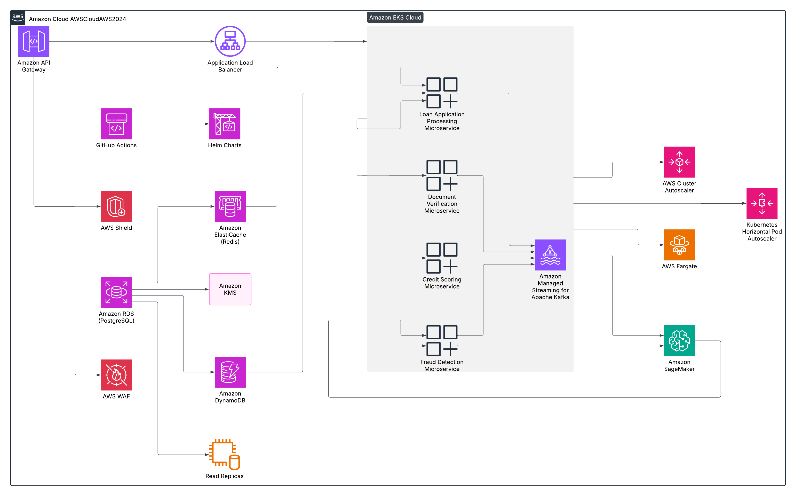

# Scaling Loan Processing to Handle a 66% Surge During the Indian Festive Season

## Introduction

India's festive season, which spans from August to November, marks a period of heightened consumer spending, particularly in the two-wheeler loan segment. Festivals like Ganesh Chaturthi, Navratri, Dussehra, and Diwali significantly boost demand, resulting in a surge of loan applications. Our lending platform, typically designed to handle **250,000 applications per month**, had to scale to **415,000 applications**, a **66% increase** in traffic, while maintaining high availability, low latency, and cost efficiency. This article details how we leveraged cloud-native technologies, microservices, and intelligent auto-scaling strategies to achieve this feat without service degradation.

## System Overview: A Cloud-Native Microservices Approach

Our loan processing platform was designed as a **distributed, event-driven, microservices-based system** hosted on **AWS Elastic Kubernetes Service (EKS)**. Each component was built as a separate microservice, ensuring modularity, independent scaling, and fault isolation. The platform consisted of services handling **application intake, credit scoring, eligibility checks, document verification, fraud detection, and loan disbursement**. These services communicated asynchronously via **Apache Kafka**, reducing tight coupling and ensuring resilience under load.

## Managing Load Spikes with API Gateway and Load Balancing

Handling a 66% surge in requests required **intelligent request distribution and load balancing**. We used **AWS API Gateway** as the entry point, which enforced **rate limiting** to prevent overwhelming backend services during peak hours. Behind API Gateway, an **Application Load Balancer (ALB)** distributed traffic across microservices based on predefined rules.

To further optimize API performance, we implemented **Amazon ElastiCache (Redis)** for **caching frequently accessed data**, reducing redundant database calls by 40% and ensuring sub-millisecond response times for common queries.

## Event-Driven Processing with Apache Kafka

A key challenge in scaling the platform was ensuring **non-blocking, asynchronous processing**. Instead of handling loan applications synchronously—which would have led to service congestion—we adopted an **event-driven architecture** using **Apache Kafka**. Each stage of loan processing (e.g., credit check, document verification) was designed as a **Kafka consumer**, processing messages in parallel. This setup enabled:
- **Efficient workload distribution**, ensuring multiple instances of microservices could process applications simultaneously.
- **Fault tolerance**, as failed messages were pushed to a **dead-letter queue (DLQ)** for retry mechanisms.
- **Real-time event tracking**, allowing auditability and seamless debugging.

## Auto-Scaling with Kubernetes and AWS EKS

Scaling microservices dynamically was crucial in handling the traffic surge. We leveraged **Kubernetes Horizontal Pod Autoscaler (HPA)** to adjust microservice replicas based on CPU and memory usage. Additionally, the **Cluster Autoscaler** automatically added or removed EC2 instances based on demand. 

However, some workloads required on-demand, short-lived scaling. For this, we deployed **AWS Fargate** for stateless microservices, which auto-scaled without managing EC2 instances, reducing infrastructure costs by **22%**. This combination of **HPA + Cluster Autoscaler + Fargate** ensured that even at peak load, our system remained highly available without excessive over-provisioning.

## Database Scaling and Optimization

A **66% increase in traffic** also meant that our **Amazon RDS (PostgreSQL) database** had to efficiently handle millions of queries. To optimize database performance, we:
- **Implemented Read Replicas**: By offloading read-heavy operations to replicas, we **reduced query latency by 32%**.
- **Used Connection Pooling (PgBouncer)**: This prevented connection exhaustion and ensured smooth handling of concurrent transactions.
- **Adopted Amazon DynamoDB for Real-Time Lookups**: For high-speed loan status queries, DynamoDB was used alongside PostgreSQL, reducing database contention.

## Integrating Machine Learning for Fraud Detection

We collaborated with the **Data Science team** to incorporate **Amazon SageMaker Fraud Detection ML models** into our loan processing pipeline. These models analyzed loan applications in real time, flagging suspicious activity based on historical fraud patterns. The integration was implemented via **Kafka Streams**, allowing fraud detection to occur asynchronously without impacting loan approval speeds. This approach significantly improved fraud detection accuracy while maintaining low latency.

## Continuous Deployment with CI/CD Pipelines

To support frequent updates and handle high traffic smoothly, we automated our deployment process using **GitHub Actions and Helm charts**. Our **CI/CD pipeline** included:
- **Automated Testing (Unit, Integration, Load Testing)** to catch regressions early.
- **Blue-Green Deployments** to enable seamless rollouts without downtime.
- **Feature Flags for Gradual Rollouts**, reducing the risk of full-scale failures.

This **cut deployment time by 40%**, ensuring we could release improvements and fixes without disrupting loan processing.

## Security and Fraud Prevention at Scale

With increased transaction volumes, fraud detection and security were critical. We implemented:
- **AWS WAF & Shield** for **DDoS protection and web security**.
- **Amazon KMS (Key Management Service)** for **data encryption**.
- **AWS Lambda + Kafka Streams** to process real-time fraud detection rules, flagging suspicious applications based on anomaly detection models.

Additionally, we trained **Amazon SageMaker ML models** on historical fraud data, improving detection accuracy over time.

## Key Results & Performance Gains

By leveraging **microservices, event-driven processing, auto-scaling, and optimized database strategies**, we successfully managed the 66% surge without service degradation. Key outcomes included:
- **415K loan applications processed** without downtime.
- **99.98% system uptime** maintained.
- **Database query latency reduced by 32%**, improving loan approval turnaround.
- **40% faster deployments** with CI/CD automation.
- **22% infrastructure cost savings** through dynamic scaling strategies.

## Conclusion

Scaling a high-throughput, cloud-native lending platform during the Indian festive season required a combination of **auto-scaling Kubernetes clusters, asynchronous Kafka-driven processing, efficient database replication, and security enhancements**. Our approach ensured that the platform seamlessly handled the surge while optimizing costs. 

